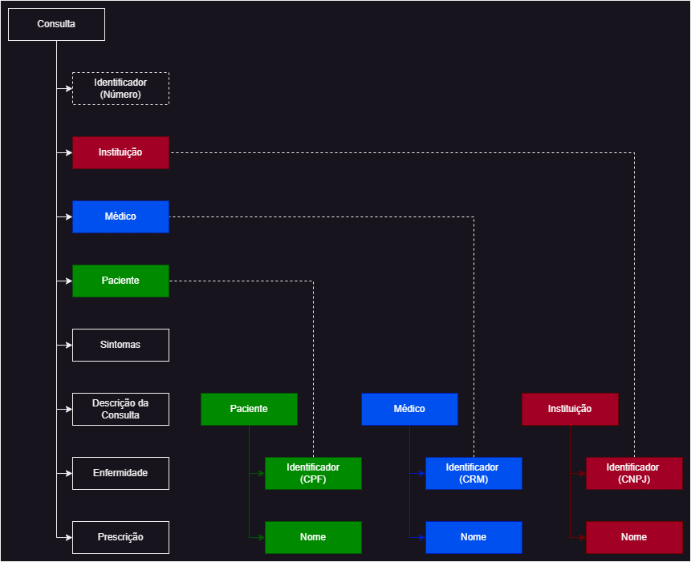
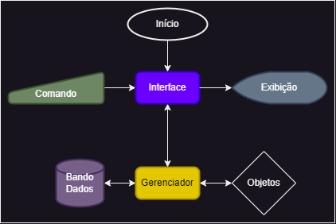
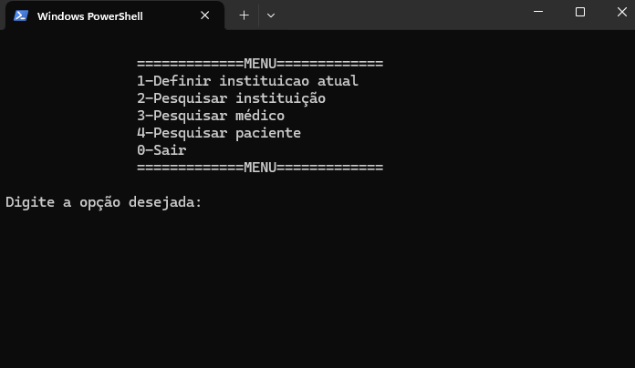
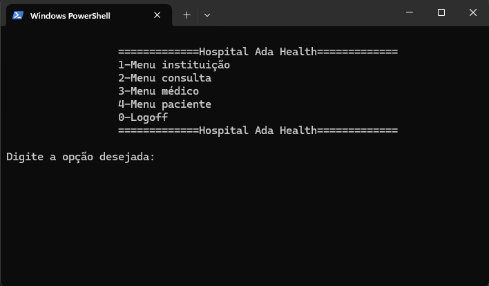
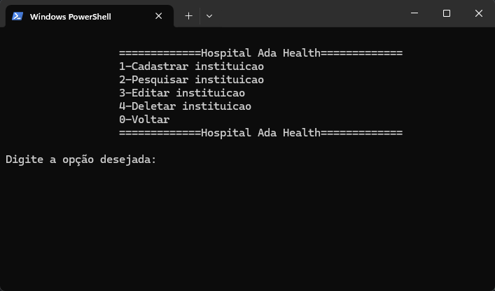

# Enunciado
Crie um CRUD!

Crie um classe `DataAlgumaCoisa` que permite que o usuário:

- **C**reate (crie) dicionários;
- **R**ead (leia) essas dicionários;
- **U**pdate (atualize) essas dicionários;
- **D**elete essas dicionários.

Para interagir com esta classe, crie uma interface (também com POO) que permita que o usuário use apenas linhas de comando para utilizar seu `DataAlgumaCoisa`.

Lembre-se: 

1. Crie dicionário
2. insira dados nos dicionários
3. visualize esses dados colocados
4. atualize esses dados colocados
5. delete esses dados colocados
6. Tudo isso com comandos a partir do terminal sem ter que digitar linhas de código.

Vou pegar seu arquivo e rodar: `python seu_arquivo.py` no meu computador e ele deve funcionar liso!

Sucesso e alegria.

# Considerações
Minha idéia com o projeto é que os registros se comportem como um banco de dados: Dessa forma, cada arquivo json representa uma tabela do banco de dados que no algorítmo ;é tratada como um objetos. Cada objeto terá um atributo chamado "identificador" que é a representação da chave primária.

O projeto consiste em um banco de dados centralizado de consultas médicas que posteriormente possa servir de base de dados para sistemas de IA. O compartilhamento de dados dentro do sistema é obrigatório a fim de se ter um histórico preciso dos pacientes cadastrados e com consultas médicas e diagnósticos realizados por instutuições que possuam o sistema.

Requisitos Gerais:
- O sistema pode ser utilizado por mais de uma instituição;
- A consulta aos dados é aberta para as instituições que possuem o sistema;
- As consultas médicas são criadas vinculadas a instituiçao que está criando;
- Uma consulta médica iniciada deve poder ser atualizada para adicionar o diagnóstico. É como se fosse primeiro o processo de triagem e posteriormente editar para adicionar o efetivo diagnóstico;

Alguns pontos importantes:
* CPF e CNPJ são considerados strings. CNPJ a partir de 2026 contará com números e letras segundo <a href="https://plbrasil.com.br/download/Nota%20COCAD%20SUARA%202024%2005%2049%20CNPJ%20Alfanumerico.pdf">Nota Técnica conjunta COCAD/SUARA/RFB nº 49 de 14 de maio de 2024</a>. CPF, por garantia também será informado como string. Ambos deve ser informados com a formatação correta.

* Nesse momento não serão considerados níveis de permissão, logins e senhas.

* O diretório **data** possui arquivos base com algumas informações pré-cadastradas, para testar as procuras sem precisar cadastrar nada. São elas:
    * conjultas.json
    <pre><code>
    "1": {
        "instituicao": "1A.1A1.A1A/AA11-99",
        "medico": "11111",
        "paciente": "111.111.111-11",
        "sintomas": "Dor de cabeça, febre, dor no corpo",
        "descricao": "Paciente relatou dor de cabeça, febre baixa e dores leves no corpo. Por conta do quadro apresentado será tratado como gripe. Em caso de febre, tomar paracetamol a cada 8 horas",
        "enfermidade": "Gripe",
        "prescricao": "Paracetamol 500mg"},
    "2": {
        "instituicao": "1A.1A1.A1A/AA11-99",
        "medico": "11111",
        "paciente": "111.111.111-11",
        "sintomas": "Dor de cabeça, febre, dor no corpo",
        "descricao": "Paciente relatou aumento na dor de cabeça e febre baixa. Dores no corpo aumentaram e perdeu o olfato. Por conta do quadro apresentado será tratado como COVID. Utilizar tamiflu gotas a cada 6 horas, 10 gotas",
        "enfermidade": "COVID",
        "prescricao": "Tamiflu gotas"},
    "3": {
        "instituicao": "1A.1A1.A1A/AA11-99",
        "medico": "22222",
        "paciente": "222.222.222-22",
        "sintomas": "Dor no peito, tosse",
        "descricao": "Paciente relata dores na altura do pulmão, tosses constantes. Etapa terminal",
        "enfermidade": "Câncer",
        "prescricao": "Nenhuma"},
    "4": {
        "instituicao": "2A.2A2.A2A/AA22-99",
        "medico": "33333",
        "paciente": "333.333.333-33",
        "sintomas": "Dor no corpo",
        "descricao": "Paciente relatou dores no corpo após atividades físicas",
        "enfermidade": "Nenhuma",
        "prescricao": "Atividades físicas regulares"},
    "5": {
        "instituicao": "2A.2A2.A2A/AA22-99",
        "medico": "44444",
        "paciente": "444.444.444-44",
        "sintomas": "Dor no corpo, febre, vômitos, diarréia",
        "descricao": "Paciente relata que os sintomas iniciaram a poucos dias, quando as temperaturas aumentaram. Prescrito paracetamol XXXg e Dragin Xg",
        "enfermidade": "Dengue",
        "prescricao": "Paracetamol, Dramin"}
    </code></pre>

    * instituicoes.json
    <pre><code>
    "1A.1A1.A1A/AA11-99": {
        "nome": "Hospital Ada Health"},
    "2A.2A2.A2A/AA22-99": {
        "nome": "Hospital Let's Health"}
    </code></pre>

    * medicos.json
    <pre><code>
    "11111":{
        "nome":"Nome do Médico 1"},
    "22222":{
        "nome":"Nome do Médico 2"}, 
    "33333":{
        "nome":"Nome do Médico 3"}, 
    "44444":{
        "nome":"Nome do Médico 4"}
    </code></pre>

    * pacientes.json
    <pre><code>
    "111.111.111-11": {
        "nome": "Paciente 1"},
    "222.222.222-22": {
        "nome": "Paciente 2"},
    "333.333.333-33": {
        "nome": "Paciente 3"},
    "444.444.444-44": {
        "nome": "Paciente 4"}
    </code></pre>

    Visualmente podem ser representadas da seguinte forma:

    

# Projeto

Para início do projeto, foi criada uma estrutura inicial dos itens relevantes. Dessa foram, foram criados os arquivos .json e as representações desses registros em objetos. 

Além disso, uma interface deve guiar o usuário pelo processo de cadastrar, pesquisar, editar e deletar registros.

Para fazer a integração entre os Objetos, a Interface e o Banco de dados, um Gerenciador vai ser criado. Dessa forma têm-se:

* Interface: responsável por guiar o usuário e inicializar objetos;
* Objetos: Representações dos itens que devem ser armazenados e visualizados;
* Banco de Dados: Armazenamento das informações;
* Gerenciador: Responsável pelo CRUD e intermediação entre os anteriores;

Para executar o projeto, executar o arquivo: <code>__ app __.py</code>.

## Menu Raiz

Primeiro menu da aplicação. 

1- Faz o "login" em uma das insituições da base de dados. Nesse ponto é apenas verificado e atribuidas as informações da instituição, sem qualquer tipo de validação, senhas, etc.

2, 3, 4- As opções de pesquisa serão detalhadas no título [Menu Objetos](#menu-objetos).

0- Encerra a aplicação.

## Menu Logado

Segundo menu da aplicação. O nome da instituição deve aparecer no lugar de "MENU"

1, 2, 3, 4- Define o tipo de objeto a ser trabalhado [Menu Objetos](#menu-objetos).

0- Faz o "logoff". O nome do menu volta para o original ("MENU").

## Menu Objetos

Terceiro menu da aplicação. O objeto em questão será visualizado de acordo com o que foi escolhido na tela anterior.

1- Cadastra um novo objeto, a partir de uma chave primária. Se for passado um valor vazio ("" ou simplesmente ENTER no input da chave primária), a operação é cancelada.

2- Pesquisa um objeto, a partir de uma chave primária. Se for passado um valor vazio ("" ou simplesmente ENTER no input da chave primária), a operação retorna todos os objetos registrados.

3- Edita um objeto, a partir de uma chave primária. Se for passado um valor vazio ("" ou simplesmente ENTER no input da chave primária), significa que será utilizada a informação original, sem necessidade de reescrever nada.

4- Deleta um objeto, a partir de uma chave primária. Se for passado um valor vazio ("" ou simplesmente ENTER no input da chave primária), a operação é cancelada. Se for a operação tentar deletar a instituição que está "logada", a operação é cancelada.